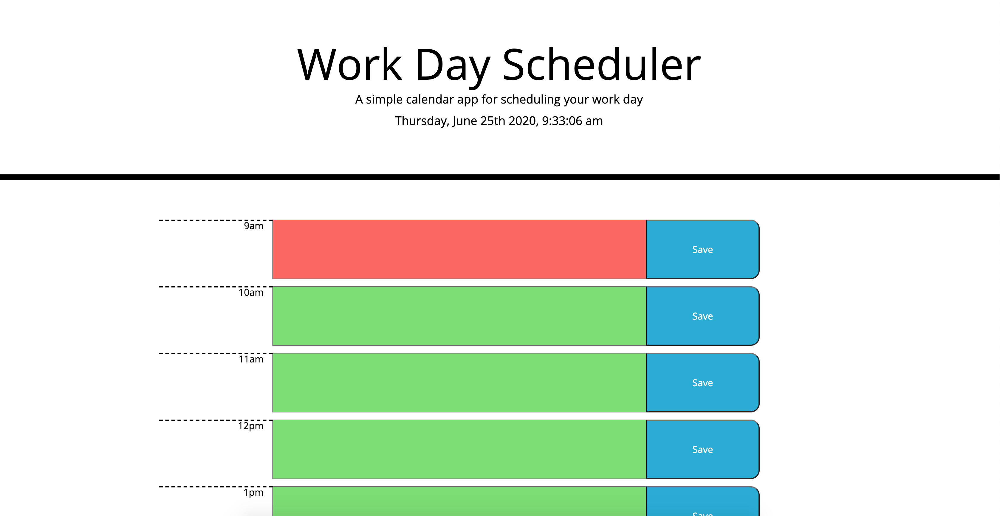

# Day Planner
Moment.js is a very useful library of time that allows one to have an alternative to the Javascript Date Object directly. Here, the objective is to create time-orientated, color change events to time-blocks. These times blocks include an hour display, a textarea input, and a savebutton. The save button saves the user input, and when refreshed the data is still there, saved in the local storage. 
## Site Picture

## Installing
Since we're using Jquery, Moment.js they both have external libraries that will enable their functionality locally. 
**Here are the provided links to those libraries in the HTML**
```
    <head>
        <link rel="stylesheet"href="https://stackpath.bootstrapcdn.com/bootstrap/4.3.1/css/bootstrap.min.css"/>
    </head>
    .
    code here
    .
    <script src="https://code.jquery.com/jquery-3.4.1.min.js"></script>
    <script src="https://cdnjs.cloudflare.com/ajax/libs/moment.js/2.24.0/moment.min.js"></script>
    <link rel="stylesheet"href="https://stackpath.bootstrapcdn.com/bootstrap/4.3.1/css/bootstrap.min.css"/>

```
This is necessary for proper use of all the Jquery specific objects, operators, etc.
## Built With 
- HTML
- CSS
- JQuery
# Deployed Link
 - [Link to Github repository](https://github.com/Kionling/day-planner)
 - [Link to Site](https://kionling.github.io/day-planner/)
 
## Authors 
* **Daniel Jauregui**
- [LinkedIn](https://www.linkedin.com/in/daniel-jauregui-velazquez-b64a80172/)
- [Instagram](https://www.instagram.com/kionling1/)
- [Twitter](https://twitter.com/Kionling1   )

## Acknowledgements
- Code Drills 

